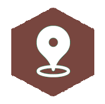

This website aims to provide an introduction to fundamental data skills needed by researchers, students, learners, government officials, journalists, and the general public in the 21st century. Data is everywhere and data literacy is becoming an increasingly important skill to have regardless of who you are and what kind of job you do or even whether you're working at all.

 

### The logo and philosphy

 

We want this resource to be the very first place people come when they want to start learning about data. We want to meet our learners where they are at, no minimum requirements to meet. If we are explaining things in an inaccessible way, using jargon that is not defined clearly, or expecting prior understanding, we want to hear from you!

 
 
  

### What this project is not...

There are loads of materials available to learn 'sexy' data skills like machine learning and AI and all the buzz words. This resource might eventually cover some of the topics relevant to 'big data', but essentially we will focus on fundamental knowledge and skills one should have to be able to find and use data, communicate about it, and manipulate, analyse, and visualise it. We won't look at 'big' data skills, but rather ubiquitous data skills that may apply to bigger or smaller data sets. 

The topics covered in _[DATASKILLS](index.html)_ are essential for any 'sexy' data project, but are often neglected when the conversation turns to Data Science, AI, and the like. 

 

### What is data literacy and why do we care?



 



 

### Who developed the content?

_[DATASKILLS](index.html)_ is an initiative developed by Anelda van der Walt from [Talarify](http://www.talarify.co.za). The project is a culmination of many years' experience in working with a wide variety of data and teaching numerous data and computational literacy courses in Africa and beyond. 

Despite the fact that this project has been in the making for many years, it finally saw the light in June 2020 in response to a request to teach a data module as part of a _21st Century Skills for Industry_ course offered to Nanotechnology Honours students at Rhodes University, South Africa. The course coordinator was Heidi Duveskog from [Contextualize](http://contextualize.co.za/). The materials on this website was compiled by [Talarify](http://www.talarify.co.za) with input from Contextualize and team members from [afrimapr](http://afrimapr.org). 

 

### Re-use

Where possible, this resource will refer to materials that are published under permissive open licenses to allow users to re-use and share the materials freely with peers and students. Resources developed under _[DATASKILLS](index.html)_ are published under [Creative Commons Attribution-NonCommercial 4.0 license](https://creativecommons.org/licenses/by-nc/4.0/) (CC-BY-NC-4.0)

You can use the online version of _[DATASKILLS](index.html)_ in any class (free or paid), and can quote short excerpts under [fair use](https://en.wikipedia.org/wiki/Fair_use) provisions, but cannot republish large parts in commercial works without prior permission.

Contributions, corrections, and suggestions are all welcome, and all contributors will be acknowledged on the site. Please see our [Contributions section](contributions.html) for details and our [Code of Conduct](code.html).

 

### Where did the inspiration come from?

The material borrows from the _[23 Research Data Things](https://au-research.github.io/ARDC-23-things/researchdata/things/
)_ originally developed by the Australian National Data Service and currently maintained by the [Australian Research Data Commons](https://ardc.edu.au/).

Other communities that has had an influence on the style and content of _[DATASKILLS](index.html)_ include [The Carpentries](https://carpentries.org) and the [Software Sustainability Institute](https://software.ac.za).

In a way, I'm hoping to provide something that might eventually turn into a reference resource for learning about data in the way that [_Teaching Tech Together_](https://teachtogether.tech/) (developed by [Greg Wilson](https://twitter.com/gvwilson)) is a reference resource for learning to teach tech.

  

**Does the site deserve a star?**

<!-- Place this tag where you want the button to render. -->
<a class="github-button" href="https://github.com/anelda/data-skills-101" data-icon="octicon-star" data-size="large" data-show-count="true" aria-label="Star anelda/data-skills-101 on GitHub">Star</a>
<!-- Place this tag in your head or just before your close body tag. -->
